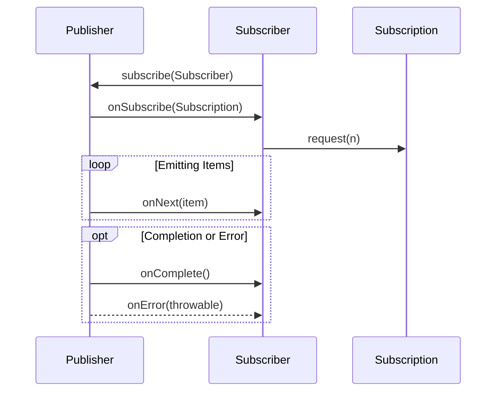
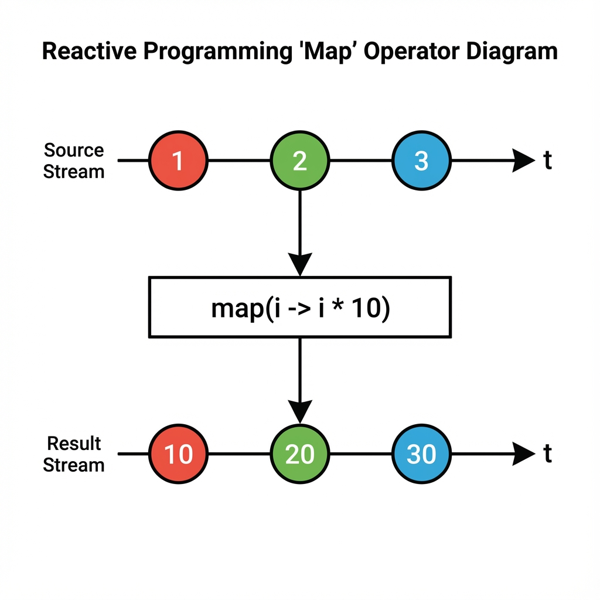
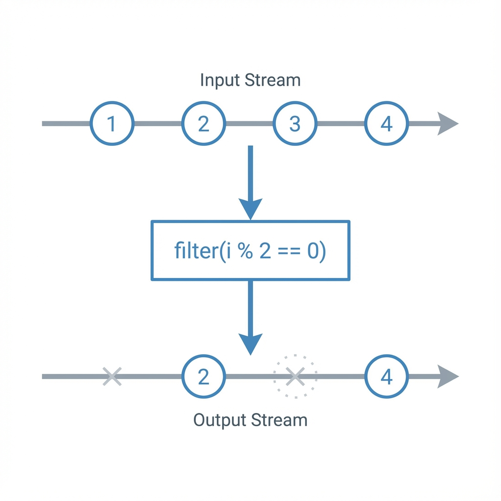

# End-to-End Java Reactive Programming Guide

## 1. Introduction to Reactive Programming

Reactive Programming is a declarative programming paradigm concerned with data streams and the propagation of change. In Java, it is often associated with the **Reactive Streams** specification and libraries like **Project Reactor** (used in Spring WebFlux) and **RxJava**.

### Why Reactive?
Traditional imperative programming often uses a **blocking** model (e.g., one thread per request). When a thread makes an I/O call (database, network), it sits idle waiting for the response. This wastes resources.

**Reactive Programming** is **non-blocking** and **asynchronous**. It allows a small number of threads to handle a massive number of concurrent requests by not waiting for I/O operations to complete. Instead, it relies on callbacks and events.

| Feature | Imperative (Blocking) | Reactive (Non-Blocking) |
| :--- | :--- | :--- |
| **Execution Model** | Synchronous, Blocking | Asynchronous, Non-Blocking |
| **Thread Usage** | One thread per request | Event loop, few threads |
| **Scalability** | Limited by thread pool size | High, handles massive concurrency |
| **Complexity** | Lower (easier to debug) | Higher (steep learning curve) |

---

## 2. Core Concepts: The Reactive Streams Specification

Java 9 introduced the `java.util.concurrent.Flow` class, which implements the Reactive Streams specification. The core interfaces are:

1.  **Publisher**: Emits a sequence of events to subscribers.
2.  **Subscriber**: Consumes events from a Publisher.
3.  **Subscription**: Represents the link between a Publisher and a Subscriber. Used for **Backpressure**.
4.  **Processor**: Acts as both a Publisher and a Subscriber (processing data between them).

### The Flow (Mermaid Diagram)



### Backpressure
Backpressure is a critical concept. It allows the **Subscriber** to control the flow of data. If the Publisher is emitting data faster than the Subscriber can process, the Subscriber can signal "I can only handle 2 items right now" via `request(2)`. This prevents the Subscriber from being overwhelmed (Out of Memory).

---

## 3. Project Reactor Basics

**Project Reactor** is the foundation of Spring WebFlux. It provides two main reactive types that implement `Publisher`:

### 3.1 Mono `<T>`
Represents a stream of **0 or 1** element.
*   Useful for: `findById`, `save`, `makeHttpRequest` (returning single response).

```java
// Creating a Mono
Mono<String> mono = Mono.just("Hello Reactive World");

// Nothing happens until you subscribe!
mono.subscribe(System.out::println);
```

### 3.2 Flux `<T>`
Represents a stream of **0 to N** elements.
*   Useful for: `findAll`, `streamData`, processing lists.

```java
// Creating a Flux
Flux<String> flux = Flux.just("Apple", "Banana", "Cherry");

flux.subscribe(System.out::println);
```

---

## 4. Key Operators

Operators allow you to transform, filter, and compose streams. They are immutable; each operator returns a new instance.

### 4.1 Transformation

**`map`**: Transform items synchronously (1-to-1).

```java
Flux.just(1, 2, 3)
    .map(i -> i * 10) // 10, 20, 30
    .subscribe(System.out::println);
```

**`flatMap`**: Transform items asynchronously (1-to-N or 1-to-Publisher). It "flattens" the inner Publishers.

```java
Flux.just(1, 2, 3)
    .flatMap(i -> callExternalService(i)) // Returns a Mono<Result> for each i
    .subscribe(System.out::println);
```

### 4.2 Filtering

**`filter`**: Pass only items that match a predicate.

```java
Flux.range(1, 10)
    .filter(i -> i % 2 == 0) // 2, 4, 6, 8, 10
    .subscribe(System.out::println);
```

### 4.3 Combination

**`zip`**: Combine multiple sources, waiting for all to emit.
```text
Flux A: [ A ]---[ B ]---|->
Flux B: [ 1 ]---[ 2 ]---|->
          |       |
         zip( (a,b) -> a+b )
          |       |
Result: [ A1 ]--[ B2 ]--|->
```
```java
Mono<String> m1 = Mono.just("A");
Mono<String> m2 = Mono.just("B");

Mono.zip(m1, m2)
    .map(tuple -> tuple.getT1() + tuple.getT2()) // "AB"
    .subscribe(System.out::println);
```

---

## 5. Advanced Concepts

### 5.1 Error Handling
In reactive streams, exceptions are events (`onError`). You shouldn't use `try-catch` blocks around operators.

*   **`onErrorReturn`**: Return a default value on error.
*   **`onErrorResume`**: Switch to a fallback sequence on error.
*   **`doOnError`**: Side-effect (log the error) without changing the stream.

```java
Flux.just("A", "B")
    .concatWith(Flux.error(new RuntimeException("Boom")))
    .onErrorReturn("Default") // Stream: A, B, Default
    .subscribe(System.out::println);
```

### 5.2 Schedulers (Concurrency)
By default, execution happens on the calling thread. You can switch contexts using Schedulers.

*   **`publishOn`**: Affects the execution of operators **downstream**.
*   **`subscribeOn`**: Affects the **source** emission (upstream).

Common Schedulers:
*   `Schedulers.boundedElastic()`: For blocking I/O (DB, Network).
*   `Schedulers.parallel()`: For CPU-intensive tasks.

```java
Flux.range(1, 10)
    .map(i -> i * 2)
    .publishOn(Schedulers.boundedElastic()) // Switch to I/O thread
    .map(i -> saveToDb(i)) // Executed on I/O thread
    .subscribe();
```

### 5.3 Hot vs Cold Publishers

It is crucial to understand how data is emitted.

*   **Cold Publisher**: Generates data **anew for each subscriber**.
    *   *Example*: An HTTP request. If 3 people subscribe, 3 HTTP requests are made.
    *   *Default*: Most Flux/Mono sources are cold.
    
    ```text
    Subscriber A: subscribe() -> [ Data ] -> [ Data ]
    Subscriber B: subscribe() -> [ Data ] -> [ Data ] (Independent)
    ```

*   **Hot Publisher**: Broadcasts data to **all current subscribers**.
    *   *Example*: A stock ticker or mouse events. If you subscribe late, you miss previous data.
    *   *Operators*: `.share()`, `.publish()`.

    ```text
    Source:       [ A ]---[ B ]---[ C ]---[ D ]--->
    Subscriber A: ^ Subscribe
                  [ A ]---[ B ]---[ C ]---[ D ]--->
    Subscriber B:                 ^ Subscribe
                                  [ C ]---[ D ]--->
    ```

---

## 6. End-to-End Example: Spring WebFlux

Here is a conceptual example of a Reactive REST API.

### Controller
```java
@RestController
@RequestMapping("/users")
public class UserController {

    private final UserRepository userRepository;

    public UserController(UserRepository userRepository) {
        this.userRepository = userRepository;
    }

    @GetMapping("/{id}")
    public Mono<User> getUser(@PathVariable String id) {
        return userRepository.findById(id);
    }

    @GetMapping
    public Flux<User> getAllUsers() {
        return userRepository.findAll();
    }

    @PostMapping
    @ResponseStatus(HttpStatus.CREATED)
    public Mono<User> createUser(@RequestBody User user) {
        return userRepository.save(user);
    }
}
```

### Service Layer (Business Logic)
```java
@Service
public class UserService {
    
    private final UserRepository userRepository;

    public UserService(UserRepository userRepository) {
        this.userRepository = userRepository;
    }

    public Flux<User> getActiveUsers() {
        return userRepository.findAll()
                .filter(User::isActive)
                .map(this::enrichUserData);
    }
    
    private User enrichUserData(User u) {
        // ... logic
        return u;
    }
}
```

### Repository (R2DBC - Reactive Relational DB)
```java
public interface UserRepository extends ReactiveCrudRepository<User, String> {
    // Returns Flux/Mono types automatically
    Flux<User> findByLastName(String lastName);
}
```

## 7. Summary Checklist for Developers

1.  **Think in Streams**: Everything is a stream of data (0, 1, or N items).
2.  **Nothing happens until you subscribe**: Don't forget `.subscribe()` (or return the type to the framework).
3.  **Avoid Blocking**: Never call `Thread.sleep()`, `jdbcTemplate`, or blocking HTTP clients inside a reactive stream. Use their reactive counterparts (WebClient, R2DBC).
4.  **Backpressure**: Be aware that consumers can control the speed of producers.
5.  **Immutability**: Operators return new instances. `flux.map(...)` does nothing if you don't use the result.
